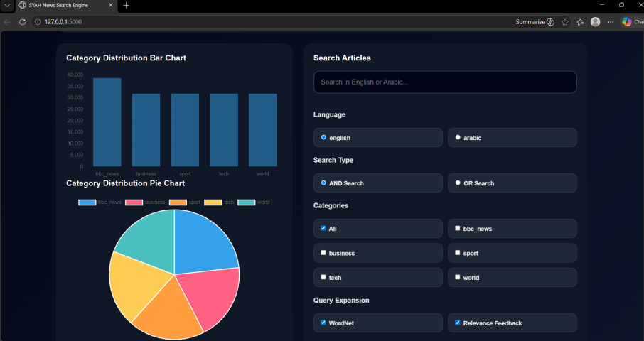

# 🔍 SYAH News Search Engine

A multilingual Information Retrieval (IR) search engine built using **Python** and **Flask**. The system retrieves relevant news articles from the **BBC News** and **AG News** datasets using Information Retrieval and Natural Language Processing (NLP) techniques, including TF-IDF ranking, inverted indexing, multilingual query support, and query expansion.

---

## 📖 Project Overview

SYAH News Search Engine was developed as part of the **DSAI 201 Information Retrieval** course.

The project combines classic Information Retrieval techniques with Natural Language Processing to provide an efficient and user-friendly search experience. It supports multilingual searching, intelligent query expansion, relevance ranking, and an interactive web interface for exploring news articles.

---

# ✨ Features

- 🔍 TF-IDF document ranking
- 📚 Inverted Index for efficient document retrieval
- 🌍 Arabic-to-English query translation
- ✍️ Query preprocessing
- 🏷️ Category filtering
- 🔎 AND / OR retrieval
- 💡 Search suggestions
- 📈 Analytics dashboard
- 🖥️ Modern Flask Web Application
- 🎨 Dark Mode Interface
- 📄 CSV Export
- 🔥 Recent Searches
- ⚡ Loading Animation

### Query Expansion Techniques

- WordNet Expansion
- Rocchio Algorithm
- CBOW Word Embeddings
- Relevance Feedback

---

# 🛠 Technologies Used

- Python
- Flask
- NLTK
- Pandas
- NumPy
- Scikit-learn
- Information Retrieval (IR)
- Natural Language Processing (NLP)
- TF-IDF
- WordNet
- Google Translator

---

# 📂 Datasets

The search engine was built using two public datasets:

- BBC News Dataset
- AG News Dataset

Before indexing, the datasets were merged and cleaned by:

- Removing missing values
- Removing duplicate documents
- Unifying news categories into a single corpus

---

# ⚙️ Information Retrieval Pipeline

The search engine follows the following pipeline:

1. Data Collection
2. Text Preprocessing
3. Inverted Index Construction
4. Query Processing
5. TF-IDF Ranking
6. Query Expansion
7. Multilingual Query Translation
8. Result Retrieval
9. Interactive Visualization

---

# 🧹 Preprocessing

The following preprocessing techniques were applied before indexing:

- Lowercasing
- Tokenization
- Stopword Removal
- Lemmatization

---

# 📈 Ranking

Documents are ranked using **TF-IDF (Term Frequency – Inverse Document Frequency)** scoring.

Supported retrieval modes:

- AND Retrieval
- OR Retrieval

---

# 🌍 Multilingual Search

The search engine supports Arabic queries.

Arabic queries are translated into English before retrieval, allowing users to search the English news corpus using Arabic input.

---

# 📸 Screenshots

## Home Page


---

## Dashboard



---

# 📁 Project Structure

```text
syah-news-search-engine/
│
├── app.py
├── requirements.txt
├── README.md
├── templates/
├── static/
├── utils/
├── data/
├── images/
└── notebooks/
```

---

# 🚀 Future Improvements

- Semantic Search using Transformer Models
- Large Language Model (LLM) Integration
- Voice Search
- Docker Deployment
- Cloud Deployment
- User Authentication
- Personalized Search Recommendations

---

# 👨‍💻 Author

**Seif Ahmed Abouelkhair**

Computer Science Student  
Zewail City of Science, Technology and Innovation

Interested in Artificial Intelligence, Machine Learning, Information Retrieval, and Natural Language Processing.

---
